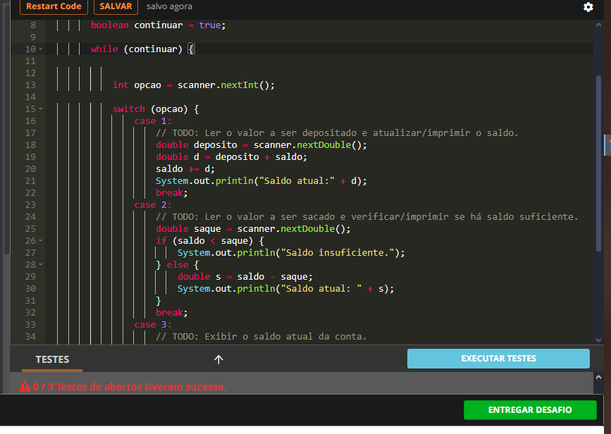
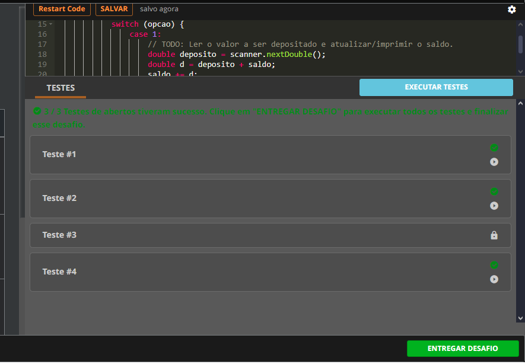

# Desafio-Banco-DIO

***Condições, Loops e Exceções na Prática com Java***

```
Desafio prático de Código do BootCamp Santander 2024;
Trilha Back-End JAVA
https://web.dio.me/track/santander-2024-backend-com-java
```


> Minhas soluções foram testadas fora do ambiente da DIO no Intellijei Community 2023 e aprendi uma maneira de resolver os desafios de forma mais rápida e com menos erros 👽;

### O repositorio no  🎱

> Primeiramente vamos a maneira correta de testar cada desafio fora do ambinete do desafio, ele funciona de forma diferente do ambinete de uma IDE;

> Eu utilizei o Intellijei mas podem usar a de sua preferência, o importante é compreender a lógica proposta pelo desafio primeiramente;

***O Código***⚛️

> AS classes foram criadas dentro do pacote "com.desafios.dio", basicamente como uma forma de encapsular o coidgo vamos dizer assim, para que na Main so sejam chamados os metodos que solucionam os desafios;


> Assim a Main ficaria assim:


***obs***‼️

➡️ Reparem que os códigos estão comentados, descomente um de cada vez e teste como quiser;

➡️ Fiquem atentos aos imports, por exemplo, se você descomentar  "ErrorEXC.java" terão que importar do pacote "com.desafios.dio.*", assim ficarão disponiveis todas as classes do pacote ;

### A Plataforma DIO 🛰

>> Na plataforma vc tem um ambiente semelhante ao abaixo no primeiro desafio. Inserindo minha resposta recebi que meu codigo não passou no teste;
>>
>
> 

> Mas se rodarmos o código na iDE ele funciona, aqui eu percebi que na plataforma e necessário que a grafia das saidas estejam corretas também, se repararmos a saída esperada esta diferente da minha saída já que "Saldo Insuficiente" estão sem o ponto final e o "I" é maiusculo, devemos nos atentar a este detalhes, Corrigindo os testes ficam ok para a entrega dos desafios;



### Conclusão ☑️

***Estes simples desafios oferecem uma boa maneira de estudar e aguçar a lógica e o pensamento computacional de inicinates na programação, tornando assim mais simples o aprendizado da linguagem 😏***;

**Vamos nos conectar** [My github](https://github.com/rafaelrss41) 👽 !!
